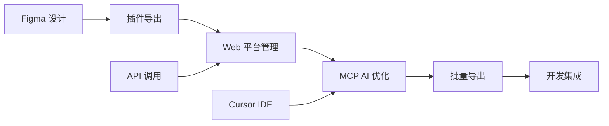

# Figma Deliver

Figma Deliver 是一个全功能的 Figma 设计资源管理和导出平台，提供从设计到开发的完整工作流支持。该项目集成了 Web 应用、Figma 插件和 MCP (Model Context Protocol) 服务，为设计师和开发者提供无缝的协作体验。

## 🚀 核心功能

### 设计资源管理
- **项目管理**: 创建、编辑和管理 Figma 项目
- **节点树可视化**: 实时显示和编辑 Figma 设计结构
- **预览系统**: 支持多种格式和缩放比例的节点预览
- **批量操作**: 支持批量导出、重命名和配置节点

### 智能导出系统
- **多格式支持**: PNG、JPG、SVG 格式导出
- **缩放选项**: 0.5x 到 4.0x 的灵活缩放比例
- **优化 JSON**: 生成包含图片路径的结构化数据
- **异步处理**: 后台任务处理大型项目导出

### MCP 集成 (AI 协作)
- **Cursor IDE 集成**: 通过 MCP 协议与 Cursor IDE 无缝连接
- **智能提示**: 为节点配置提供 AI 驱动的优化建议
- **实时同步**: 设计变更与开发环境实时同步
- **调用日志**: 完整的 MCP 操作记录和分析

### Figma 插件
- **直接集成**: 在 Figma 中直接操作和导出
- **实时预览**: 插件内预览节点效果
- **批量处理**: 支持多节点批量操作
- **认证管理**: 安全的用户认证和权限控制

## 🏗️ 项目架构

### 技术栈
- **后端**: Go + Gin + GORM + MySQL
- **前端**: Vue.js + Element UI + Axios
- **插件**: Figma Plugin API + JavaScript
- **协议**: MCP (Model Context Protocol)
- **部署**: Docker 支持，跨平台兼容

### 目录结构

```
figma-deliver/service/
├── cmd/                    # 应用程序入口
│   └── main.go            # 主程序文件
├── configs/               # 配置管理
│   ├── config.env         # 环境配置
│   └── config.example.env # 配置模板
├── internal/              # 核心业务逻辑
│   ├── controllers/       # HTTP 控制器
│   │   ├── api.go        # API 接口控制器
│   │   ├── auth.go       # 认证控制器
│   │   ├── figma.go      # Figma 相关控制器
│   │   ├── mcp.go        # MCP 协议控制器
│   │   └── pages.go      # 页面渲染控制器
│   ├── middleware/        # 中间件
│   │   ├── auth.go       # 认证中间件
│   │   ├── cors.go       # 跨域中间件
│   │   └── jwt.go        # JWT 处理
│   ├── models/           # 数据模型
│   │   ├── db.go         # 数据库连接
│   │   ├── user.go       # 用户模型
│   │   ├── figma.go      # Figma 项目模型
│   │   └── mcp.go        # MCP 连接模型
│   └── services/         # 业务服务层
│       ├── figma.go      # Figma API 服务
│       ├── export.go     # 导出服务
│       └── mcp.go        # MCP 服务管理
├── web/                  # Web 前端资源
│   ├── static/           # 静态文件
│   │   ├── css/         # 样式文件
│   │   ├── js/          # JavaScript 文件
│   │   └── lib/         # 第三方库
│   └── templates/        # HTML 模板
│       ├── dashboard.html # 主编辑界面
│       ├── mcp-logs.html # MCP 日志页面
│       └── ...          # 其他页面模板
├── figma-plugin/         # Figma 插件
│   ├── manifest.json     # 插件清单
│   ├── src/             # 插件逻辑
│   │   └── code.js      # 主要插件代码
│   └── ui/              # 插件界面
│       ├── ui.html      # 插件 UI
│       └── service.js   # 服务通信
├── temp/                 # 临时文件存储
│   ├── exports/         # 导出文件
│   └── [project-dirs]/  # 项目缓存
└── demo/                # 演示和测试脚本
    ├── test_mcp.ps1     # MCP 功能测试
    └── ...              # 其他测试文件
```

## 🛠️ 安装与部署

### 系统要求
- **Go**: 1.19 或更高版本
- **MySQL**: 5.7 或更高版本
- **Node.js**: 16+ (用于前端资源管理)
- **Figma**: 桌面版或 Web 版

### 快速开始

#### 1. 环境配置
```bash
# 克隆项目
git clone <repository-url>
cd figma-deliver/service

# 配置环境变量
cp configs/config.example.env configs/config.env
# 编辑 config.env 设置数据库连接等配置
```

#### 2. 数据库设置
```sql
-- 创建数据库
CREATE DATABASE figma_deliver CHARACTER SET utf8mb4 COLLATE utf8mb4_unicode_ci;

-- 创建用户（可选）
CREATE USER 'figma_user'@'localhost' IDENTIFIED BY 'your_password';
GRANT ALL PRIVILEGES ON figma_deliver.* TO 'figma_user'@'localhost';
```

#### 3. 启动服务
```bash
# 安装依赖
go mod download

# 运行服务（开发模式）
go run cmd/main.go

# 或编译后运行
go build -o figma-deliver cmd/main.go
./figma-deliver
```

#### 4. 安装 Figma 插件
```bash
# 进入插件目录
cd figma-plugin

# 打包插件（Windows）
package.bat

# 在 Figma 中导入插件
# 菜单: 插件 > 开发 > 导入插件
# 选择: figma-plugin/manifest.json
```

## 📖 使用指南

### Web 界面操作

#### 1. 项目管理
```
访问: http://localhost:8080
登录 → 项目列表 → 创建/编辑项目
```

#### 2. 设计编辑
- **节点树**: 左侧显示 Figma 设计结构
- **预览区**: 中央显示节点预览图
- **属性面板**: 右侧编辑节点属性
- **导出控制**: 底部设置导出参数

#### 3. 导出功能
- **格式选择**: PNG、JPG、SVG
- **缩放设置**: 0.5x - 4.0x 灵活缩放
- **批量导出**: 一键导出所有标记节点
- **JSON 数据**: 包含图片路径的结构化数据

### Figma 插件使用

#### 1. 基本操作
```
Figma → 插件 → Figma Deliver
1. 服务器认证
2. 选择节点
3. 预览/导出
4. 同步到 Web 平台
```

#### 2. 高级功能
- **批量预览**: 多节点同时预览
- **实时同步**: 设计变更自动同步
- **格式转换**: 插件内格式选择

### MCP 集成 (Cursor IDE)

#### 1. 配置 MCP 连接
```json
// cursor-mcp-config.json
{
  "mcps": {
    "figma-deliver": {
      "command": "curl",
      "args": ["-X", "POST", "http://localhost:8080/mcp/connect"],
      "env": {
        "FIGMA_TOKEN": "your-token"
      }
    }
  }
}
```

#### 2. 使用 AI 协作
- **智能提示**: 获取节点优化建议
- **配置生成**: AI 驱动的配置方案
- **实时查询**: 在 Cursor 中直接查询设计信息

## 🔌 API 参考

### 核心 API 端点

#### 认证相关
```http
POST /login                    # 用户登录
POST /register                 # 用户注册
POST /logout                   # 用户登出
GET  /profile                  # 获取用户信息
```

#### 项目管理
```http
GET    /projects               # 获取项目列表
POST   /projects               # 创建项目
GET    /projects/:id           # 获取项目详情
PUT    /projects/:id           # 更新项目
DELETE /projects/:id           # 删除项目
```

#### Figma 集成
```http
GET  /figma/node/:file_key/:node_id           # 获取节点数据
GET  /figma/image/:project_id/:node_id        # 获取节点图片
POST /figma/project/:project_id/export       # 导出项目
GET  /figma/export/status/:job_id            # 查询导出状态
GET  /figma/export/download/:job_id          # 下载导出文件
```

#### MCP 协议
```http
POST   /mcp/connect                          # 创建 MCP 连接
DELETE /mcp/disconnect/:connection_id        # 断开连接
GET    /mcp/status/:connection_id           # 连接状态
POST   /mcp/ping/:connection_id             # 心跳检测
GET    /mcp/:connection_id/preview/:project_id/:node_id  # 获取预览
GET    /mcp/:connection_id/config/:project_id/:node_id   # 获取配置
POST   /mcp/:connection_id/config/:project_id/:node_id   # 设置配置
```

#### API 服务模块 (`/api`)
> **认证方式**: 通过 MCP Token 验证，无需登录状态

```http
GET  /api/:mcptoken                        # 通过Token获取用户信息
GET  /api/:mcptoken/optimized_nodes            # 获取优化JSON数据
GET  /api/:mcptoken/project_nodes                  # 获取项目节点列表
POST /api/:mcptoken/clear_cache            # 清除节点缓存
POST /api/:mcptoken/clear_temp_files       # 清除临时文件
GET  /api/:mcptoken/download_image         # 下载Figma图片
```

### 响应格式

#### 成功响应
```json
{
  "success": true,
  "data": { /* 响应数据 */ },
  "message": "操作成功"
}
```

#### 错误响应
```json
{
  "success": false,
  "error": "错误描述",
  "code": "ERROR_CODE"
}
```

## 📋 API 详细说明

### API 服务模块 (`/api`) 详细文档

API 服务模块是专为外部集成设计的无状态接口，通过 MCP Token 进行身份验证，支持跨平台调用。

#### 🔑 认证机制

**MCP Token 获取方式**:
1. 登录 Web 界面
2. 进入个人资料页面
3. 生成或查看 MCP Token
4. 在 API 调用中使用该 Token

#### 📡 接口详情

##### 1. 获取用户信息
```http
GET /api/{mcptoken}
```

**功能**: 通过 MCP Token 验证身份并获取用户基本信息

**请求示例**:
```bash
curl -X GET "http://localhost:8080/api/your_mcp_token_here"
```

**响应示例**:
```json
{
  "success": true,
  "data": {
    "user_id": 1,
    "username": "john_doe",
    "created_at": "2024-01-01T00:00:00Z"
  },
  "message": "用户信息获取成功"
}
```

##### 2. 获取优化JSON数据
```http
GET /api/{mcptoken}/optimized_nodes?file_key={file_key}&root_node_id={node_id}
```

**功能**: 获取指定 Figma 文件的优化节点数据，包含节点修改信息

**查询参数**:
- `file_key` (必需): Figma 文件键
- `root_node_id` (必需): 根节点ID

**请求示例**:
```bash
curl -X GET "http://localhost:8080/api/your_token/optimized_nodes?file_key=ABC123&root_node_id=1:2"
```

**响应示例**:
```json
{
  "success": true,
  "data": {
    "project": {
      "id": 1,
      "name": "设计项目",
      "file_key": "ABC123",
      "root_node_id": "1:2"
    },
    "nodes": [
      {
        "id": "1:3",
        "name": "Button",
        "type": "INSTANCE",
        "modifys": {
          "isVisible": true,
          "customName": "主按钮",
          "img_ext": "png"
        }
      }
    ],
    "total_nodes": 1,
    "visible_nodes": 1
  },
  "message": "获取优化JSON数据成功"
}
```

##### 3. 获取项目节点列表
```http
GET /api/{mcptoken}/project_nodes?file_key={file_key}&root_node_id={node_id}
```

**功能**: 获取项目的所有节点信息，包含修改状态

**查询参数**:
- `file_key` (必需): Figma 文件键
- `root_node_id` (必需): 根节点ID

**请求示例**:
```bash
curl -X GET "http://localhost:8080/api/your_token/project_nodes?file_key=ABC123&root_node_id=1:2"
```

**响应示例**:
```json
{
  "success": true,
  "data": {
    "nodes": [
      {
        "node_id": "1:3",
        "modifys": "{\"isVisible\":true,\"customName\":\"主按钮\"}",
        "created_at": "2024-01-01T00:00:00Z",
        "updated_at": "2024-01-01T12:00:00Z"
      }
    ],
    "count": 1
  },
  "message": "获取节点列表成功"
}
```

##### 4. 清除节点缓存
```http
POST /api/{mcptoken}/clear_cache
```

**功能**: 清除指定项目的所有缓存文件

**请求体**:
```json
{
  "file_key": "ABC123",
  "root_node_id": "1:2"
}
```

**请求示例**:
```bash
curl -X POST "http://localhost:8080/api/your_token/clear_cache" \
  -H "Content-Type: application/json" \
  -d '{"file_key":"ABC123","root_node_id":"1:2"}'
```

**响应示例**:
```json
{
  "success": true,
  "data": {
    "cleared_files": 15,
    "cache_size_freed": "2.5MB"
  },
  "message": "缓存清理成功"
}
```

##### 5. 清除临时文件
```http
POST /api/{mcptoken}/clear_temp_files
```

**功能**: 清除用户的所有临时文件

**请求示例**:
```bash
curl -X POST "http://localhost:8080/api/your_token/clear_temp_files"
```

**响应示例**:
```json
{
  "success": true,
  "data": {
    "cleared_directories": 3,
    "total_size_freed": "10.2MB"
  },
  "message": "临时文件清理成功"
}
```

##### 6. 下载Figma图片
```http
GET /api/{mcptoken}/download_image?file_key={file_key}&node_id={node_id}&format={format}&scale={scale}
```

**功能**: 下载指定节点的图片

**查询参数**:
- `file_key` (必需): Figma 文件键
- `node_id` (必需): 节点ID
- `format` (可选): 图片格式 (png|jpg|svg，默认png)
- `scale` (可选): 缩放比例 (0.5-4.0，默认1.0)

**请求示例**:
```bash
curl -X GET "http://localhost:8080/api/your_token/download_image?file_key=ABC123&node_id=1:3&format=png&scale=2.0" \
  -o "button.png"
```

**响应**: 直接返回图片文件流

#### 🔧 集成示例

##### Python 集成示例
```python
import requests
import json

class FigmaDeliverAPI:
    def __init__(self, base_url, mcp_token):
        self.base_url = base_url.rstrip('/')
        self.mcp_token = mcp_token
    
    def get_user_info(self):
        """获取用户信息"""
        url = f"{self.base_url}/api/{self.mcp_token}"
        response = requests.get(url)
        return response.json()
    
    def get_optimized_json(self, file_key, root_node_id):
        """获取优化JSON数据"""
        url = f"{self.base_url}/api/{self.mcp_token}/optimized_nodes"
        params = {
            'file_key': file_key,
            'root_node_id': root_node_id
        }
        response = requests.get(url, params=params)
        return response.json()
    
    def download_image(self, file_key, node_id, format='png', scale=1.0):
        """下载节点图片"""
        url = f"{self.base_url}/api/{self.mcp_token}/download_image"
        params = {
            'file_key': file_key,
            'node_id': node_id,
            'format': format,
            'scale': scale
        }
        response = requests.get(url, params=params)
        return response.content

# 使用示例
api = FigmaDeliverAPI('http://localhost:8080', 'your_mcp_token')
user_info = api.get_user_info()
print(f"用户: {user_info['data']['username']}")

# 获取设计数据
design_data = api.get_optimized_json('ABC123', '1:2')
print(f"节点数量: {design_data['data']['total_nodes']}")

# 下载图片
image_data = api.download_image('ABC123', '1:3', 'png', 2.0)
with open('button.png', 'wb') as f:
    f.write(image_data)
```

##### JavaScript/Node.js 集成示例
```javascript
class FigmaDeliverAPI {
    constructor(baseUrl, mcpToken) {
        this.baseUrl = baseUrl.replace(/\/$/, '');
        this.mcpToken = mcpToken;
    }

    async getUserInfo() {
        const response = await fetch(`${this.baseUrl}/api/${this.mcpToken}`);
        return await response.json();
    }

    async getOptimizedJSON(fileKey, rootNodeId) {
        const url = new URL(`${this.baseUrl}/api/${this.mcpToken}/optimized_nodes`);
        url.searchParams.append('file_key', fileKey);
        url.searchParams.append('root_node_id', rootNodeId);
        
        const response = await fetch(url);
        return await response.json();
    }

    async downloadImage(fileKey, nodeId, format = 'png', scale = 1.0) {
        const url = new URL(`${this.baseUrl}/api/${this.mcpToken}/download_image`);
        url.searchParams.append('file_key', fileKey);
        url.searchParams.append('node_id', nodeId);
        url.searchParams.append('format', format);
        url.searchParams.append('scale', scale);
        
        const response = await fetch(url);
        return await response.arrayBuffer();
    }

    async clearCache(fileKey, rootNodeId) {
        const response = await fetch(`${this.baseUrl}/api/${this.mcpToken}/clear_cache`, {
            method: 'POST',
            headers: {
                'Content-Type': 'application/json'
            },
            body: JSON.stringify({
                file_key: fileKey,
                root_node_id: rootNodeId
            })
        });
        return await response.json();
    }
}

// 使用示例
const api = new FigmaDeliverAPI('http://localhost:8080', 'your_mcp_token');

async function main() {
    try {
        // 获取用户信息
        const userInfo = await api.getUserInfo();
        console.log(`用户: ${userInfo.data.username}`);

        // 获取设计数据
        const designData = await api.getOptimizedJSON('ABC123', '1:2');
        console.log(`节点数量: ${designData.data.total_nodes}`);

        // 清除缓存
        const clearResult = await api.clearCache('ABC123', '1:2');
        console.log(`清理了 ${clearResult.data.cleared_files} 个文件`);

    } catch (error) {
        console.error('API调用失败:', error);
    }
}

main();
```

#### 🚨 错误处理

常见错误码及处理方式：

| 错误码 | 说明 | 解决方案 |
|--------|------|----------|
| 400 | 请求参数错误 | 检查必需参数是否提供 |
| 401 | MCP Token无效 | 重新生成Token或检查Token格式 |
| 404 | 资源不存在 | 确认file_key和node_id是否正确 |
| 500 | 服务器内部错误 | 检查服务器日志，联系管理员 |

#### 📊 性能优化建议

1. **缓存策略**: API会自动缓存Figma数据，避免频繁调用相同接口
2. **批量操作**: 尽量使用批量接口而非单个节点循环调用
3. **图片下载**: 大图片建议使用较小的scale值以提高下载速度
4. **错误重试**: 实现指数退避重试机制处理临时网络问题

## 🔄 开发工作流集成

### 设计到开发的完整流程



#### 1. 传统工作流
```
设计师 → Figma 设计 → 插件导出 → Web 管理 → 开发者获取
```

#### 2. AI 增强工作流
```
设计师 → Figma 设计 → MCP 连接 → Cursor IDE → AI 优化 → 自动导出
```

#### 3. 自动化集成
```bash
# CI/CD 集成示例
curl -X POST "http://your-server/figma/project/123/export" \
  -H "Authorization: Bearer $API_TOKEN" \
  -d '{"format": "png", "scale": 2.0}'
```

## 🛠️ 高级配置

### 环境变量配置
```env
# 数据库配置
DB_HOST=localhost
DB_PORT=3306
DB_USER=figma_user
DB_PASSWORD=your_password
DB_NAME=figma_deliver

# Figma API
FIGMA_API_URL=https://api.figma.com

# 服务配置
SERVER_PORT=8080
JWT_SECRET=your_jwt_secret
CORS_ORIGINS=http://localhost:3000,https://your-domain.com

# MCP 配置
MCP_TIMEOUT=30m
MCP_MAX_CONNECTIONS=100
```

### 性能优化
- **缓存策略**: Redis 缓存预览图片
- **并发处理**: Go 协程处理导出任务
- **数据库优化**: 索引优化和连接池配置
- **CDN 集成**: 静态资源 CDN 分发

## 🔍 故障排除

### 常见问题

#### 服务启动失败
```bash
# 检查端口占用
netstat -an | grep :8080

# 检查数据库连接
mysql -h localhost -u figma_user -p figma_deliver
```

#### 插件连接问题
```javascript
// 检查插件配置
console.log('Server URL:', localStorage.getItem('serverUrl'));
console.log('Auth Token:', localStorage.getItem('authToken'));
```

#### MCP 连接异常
```bash
# 测试 MCP 连接
curl -X POST "http://localhost:8080/mcp/connect" \
  -H "Content-Type: application/json" \
  -d '{"user_id": 1}'
```

### 日志分析
```bash
# 查看服务日志
tail -f logs/figma-deliver.log

# 查看 MCP 调用日志
curl "http://localhost:8080/mcp-api/logs/1?limit=50"
```

## 🤝 贡献指南

### 开发环境设置
```bash
# Fork 项目并克隆
git clone https://github.com/your-username/figma-deliver.git
cd figma-deliver/service

# 创建开发分支
git checkout -b feature/your-feature-name

# 安装开发依赖
go mod download
```

### 代码规范
- **Go**: 遵循 `gofmt` 和 `golint` 规范
- **JavaScript**: 使用 ESLint 配置
- **提交**: 使用 Conventional Commits 格式

### 测试
```bash
# 运行单元测试
go test ./...

# 运行集成测试
./demo/test_mcp.ps1
```

## 📄 许可证

本项目采用 [MIT License](LICENSE) 开源协议。

## 📞 支持与联系

- **文档**: 查看 `docs/` 目录获取详细文档
- **问题报告**: 使用 GitLab Issues
- **功能请求**: 使用 GitLab Discussions
- **安全问题**: 发送邮件至 security@example.com