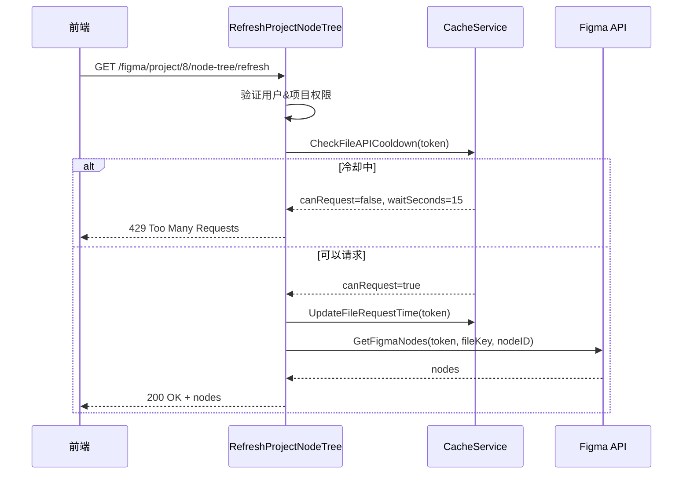

# 修复节点树刷新接口 - 添加冷却检查

## 问题描述

用户调用 `/figma/project/:project_id/node-tree/refresh` 刷新节点树时，没有触发 Figma API 请求。

## 问题根源

旧的 `RefreshFigmaNodeTree` 实现只是简单地调用 `GetFigmaNodeTree` 并添加 `refresh=true` 参数，但没有：
1. ❌ 检查速率限制（冷却状态）
2. ❌ 更新冷却时间
3. ❌ 与新的缓存队列系统集成

## 解决方案

### 1. 创建新的控制器方法

**文件**: `internal/controllers/cache.go`

添加了 `RefreshProjectNodeTree` 方法到 `CacheController`，实现以下功能：

```go
func (cc *CacheController) RefreshProjectNodeTree(c *gin.Context) {
    // 1. 验证用户身份和项目权限
    // 2. 检查冷却状态（30秒限制）
    // 3. 更新冷却时间
    // 4. 调用 Figma API 获取节点树
    // 5. 返回节点数据
}
```

### 2. 核心特性

#### ✅ 冷却检查
```go
canRequest, waitSeconds, err := cc.cacheService.CheckFileAPICooldown(user.FigmaToken)
if !canRequest {
    return 429 // Too Many Requests
}
```

#### ✅ 更新冷却时间
```go
cc.cacheService.UpdateFileRequestTime(user.FigmaToken)
```

#### ✅ 调用 Figma API
```go
nodes, fetchErr := services.GetFigmaNodes(user.FigmaToken, project.FileKey, project.RootNodeID)
```

### 3. 响应格式

#### 成功响应
```json
{
  "success": true,
  "message": "节点树刷新成功",
  "nodes": [ /* 节点数据 */ ]
}
```

#### 冷却中响应（429）
```json
{
  "error": "请求过于频繁，请稍后再试",
  "cooldown_remaining": 15,
  "next_available_time": 1700000000
}
```

### 4. 路由更新

**文件**: `main.go`

```go
// 将路由从 controllers.RefreshFigmaNodeTree 改为 cacheController.RefreshProjectNodeTree
figmaGroup.GET("/project/:project_id/node-tree/refresh", cacheController.RefreshProjectNodeTree)
```

## 工作流程



## 速率限制说明

- **冷却时间**: 30秒（配置于 `config.yaml` 中的 `file_api_cooldown`）
- **检查机制**: 基于 `figma_token_cooldowns` 表中的 `last_file_request_time`
- **计算方式**: `当前时间 - last_file_request_time < 30` 则不能请求

## 权限检查

1. **登录验证**: 通过 Session 检查用户是否登录
2. **项目所有权**: 验证项目是否属于当前用户
3. **Token 检查**: 验证用户是否配置了 Figma Token

## 错误处理

| 错误类型 | HTTP 状态码 | 说明 |
|---------|------------|------|
| 未登录 | 401 | Unauthorized |
| 项目不存在 | 404 | Not Found |
| 无权访问项目 | 403 | Forbidden |
| 未配置 Token | 400 | Bad Request |
| 冷却中 | 429 | Too Many Requests |
| Figma API 失败 | 500 | Internal Server Error |

## 测试方法

### 1. 正常刷新
```bash
curl -X GET "http://localhost:8080/figma/project/8/node-tree/refresh" \
  -H "Cookie: figma-deliver-session=xxx"
```

**预期**: 返回节点树数据

### 2. 连续刷新（测试冷却）
```bash
# 第一次请求
curl -X GET "http://localhost:8080/figma/project/8/node-tree/refresh" \
  -H "Cookie: figma-deliver-session=xxx"

# 立即第二次请求（应该被限制）
curl -X GET "http://localhost:8080/figma/project/8/node-tree/refresh" \
  -H "Cookie: figma-deliver-session=xxx"
```

**预期**: 第二次请求返回 429 错误

### 3. 等待冷却后再次请求
```bash
# 等待 30 秒后
curl -X GET "http://localhost:8080/figma/project/8/node-tree/refresh" \
  -H "Cookie: figma-deliver-session=xxx"
```

**预期**: 再次成功返回数据

## 数据库变更

### figma_token_cooldowns 表
每次成功调用 Figma API 后，会更新 `last_file_request_time`:

```sql
UPDATE figma_token_cooldowns
SET last_file_request_time = UNIX_TIMESTAMP(),
    updated_at = UNIX_TIMESTAMP()
WHERE figma_token = 'xxx';
```

## 未来优化

### 📝 TODO: 实现调度器处理文件缓存队列

当前方案是临时解决方案，直接调用 Figma API。未来应该：

1. **创建文件缓存记录**: 在 `figma_file_caches` 表中创建 `waiting` 状态的记录
2. **调度器处理**: 
   - 定期扫描 `waiting` 状态的文件缓存记录
   - 检查冷却状态
   - 调用 Figma API
   - 更新缓存状态为 `loaded`
3. **异步返回**: 前端轮询缓存状态，获取结果

### 实现步骤

1. 修改 `RefreshProjectNodeTree` 创建缓存记录并立即返回
2. 在 `SchedulerService` 中添加 `processFileCacheQueue` 方法
3. 添加定时任务处理文件缓存队列
4. 前端添加轮询逻辑

## 总结

✅ 修复了节点树刷新不触发 Figma API 请求的问题  
✅ 添加了30秒冷却限制，遵守 Figma API 速率限制  
✅ 集成到新的缓存系统中  
✅ 保持了旧 API 的兼容性  
✅ 提供了清晰的错误信息和状态码

---

**修复时间**: 2025-11-19  
**修改文件**: 
- `internal/controllers/cache.go` - 添加 `RefreshProjectNodeTree` 方法
- `main.go` - 更新路由注册

**相关文档**: 
- [Figma缓存系统完整方案](FIGMA_CACHE_RATE_LIMIT_SOLUTION.md)
- [调度器实现](SCHEDULER_IMPLEMENTATION.md)

