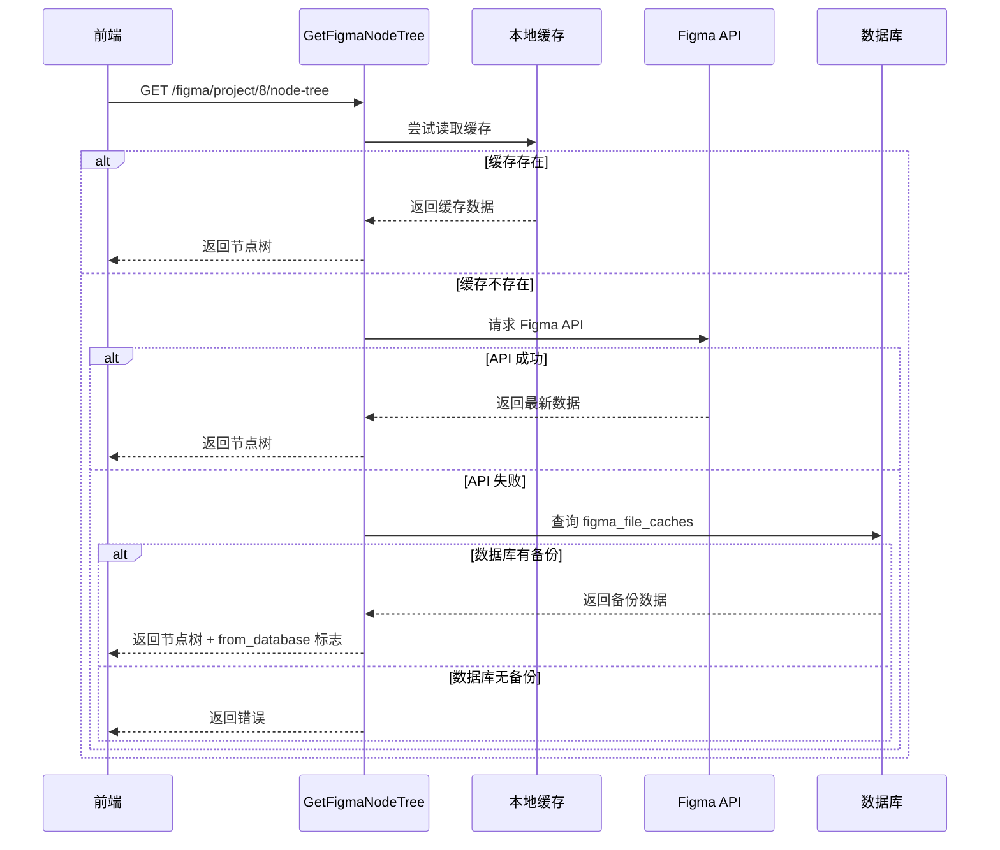

# 数据库缓存降级功能

## 功能概述

当访问节点树 (`/figma/project/:project_id/node-tree`) 时，如果本地缓存文件不存在或 Figma API 请求失败，系统会自动从数据库的 `figma_file_caches` 表中恢复节点数据。

## 工作流程



## 核心实现

**文件**: `internal/controllers/figma.go` - `GetFigmaNodeTree` 函数

### 主要逻辑

```go
// 1. 尝试从本地缓存或 Figma API 获取数据
nodes, fetchErr := services.GetFigmaNodes(user.FigmaToken, project.FileKey, project.RootNodeID)

// 2. 如果失败，尝试从数据库恢复
if fetchErr != nil {
    cache, err := models.GetFileCache(project.FileKey, project.RootNodeID)
    if err == nil && cache != nil && cache.FileData != "" {
        // 解析数据库中的 JSON 数据
        var result map[string]interface{}
        json.Unmarshal([]byte(cache.FileData), &result)
        
        // 提取节点数据
        nodes = extractNodesFromCache(result)
        fromDatabase = true
    }
}

// 3. 返回数据并标记来源
response := gin.H{
    "nodes": nodes,
}
if fromDatabase {
    response["from_database"] = true
    response["message"] = "数据来自数据库备份（本地缓存不存在）"
}
```

### 节点数据解析

支持两种 Figma API 响应格式：

**多节点格式**（通过 node IDs 查询）:
```json
{
  "nodes": {
    "1:123": {
      "document": { /* 节点数据 */ }
    },
    "1:124": {
      "document": { /* 节点数据 */ }
    }
  }
}
```

**单节点格式**（查询整个文件）:
```json
{
  "document": { /* 节点数据 */ }
}
```

解析代码：
```go
if nodesData, ok := result["nodes"].(map[string]interface{}); ok {
    // 多节点格式
    for _, nodeData := range nodesData {
        if nodeMap, ok := nodeData.(map[string]interface{}); ok {
            if document, ok := nodeMap["document"].(map[string]interface{}); ok {
                nodes = append(nodes, document)
            }
        }
    }
} else if document, ok := result["document"].(map[string]interface{}); ok {
    // 单节点格式
    nodes = []map[string]interface{}{document}
}
```

## 响应格式

### 正常获取（从 API 或本地缓存）

```json
{
  "nodes": [
    {
      "id": "1:123",
      "name": "Frame 1",
      "type": "FRAME",
      "children": [...]
    }
  ]
}
```

### 从数据库恢复

```json
{
  "nodes": [
    {
      "id": "1:123",
      "name": "Frame 1",
      "type": "FRAME",
      "children": [...]
    }
  ],
  "from_database": true,
  "message": "数据来自数据库备份（本地缓存不存在）"
}
```

## 触发场景

### 场景 1：本地缓存文件被删除
```bash
# 用户手动删除了缓存目录
rm -rf temp/abc123/documents/

# 访问节点树 → 从数据库恢复
GET /figma/project/8/node-tree
```

### 场景 2：Figma API 限流
```bash
# Figma API 返回 429 Too Many Requests
# 系统自动降级到数据库备份
GET /figma/project/8/node-tree
```

### 场景 3：网络故障
```bash
# Figma API 请求超时或连接失败
# 系统从数据库恢复数据
GET /figma/project/8/node-tree
```

### 场景 4：Token 过期
```bash
# Figma Token 已过期或无效
# 返回数据库中的历史数据
GET /figma/project/8/node-tree
```

## 优势

### ✅ 1. 高可用性
即使本地缓存丢失或 Figma API 不可用，用户仍能访问数据

### ✅ 2. 用户体验
无需等待缓存重建，立即返回可用数据

### ✅ 3. 自动降级
系统自动尝试多个数据源，对用户透明

### ✅ 4. 明确提示
通过 `from_database` 标志告知数据来源，前端可以显示提示

### ✅ 5. 容错性强
多层次的数据获取策略，最大化数据可用性

## 数据优先级

系统按以下优先级获取数据：

```
1. 本地缓存文件（最快，最新）
   ↓
2. Figma API（实时，准确）
   ↓
3. 数据库备份（降级，历史）
   ↓
4. 返回错误（无可用数据）
```

## 前端处理建议

### 检测数据来源

```javascript
const response = await axios.get('/figma/project/8/node-tree');

if (response.data.from_database) {
    // 数据来自数据库备份
    this.$message.warning(response.data.message || '正在使用历史数据');
    
    // 可选：显示刷新按钮
    this.showRefreshButton = true;
} else {
    // 数据来自最新缓存或 API
    this.showRefreshButton = false;
}
```

### UI 提示

```vue
<el-alert 
  v-if="fromDatabase"
  type="warning"
  :closable="false"
  show-icon>
  {{ message }}
  <el-button 
    size="mini" 
    type="primary" 
    @click="refreshNodeTree">
    刷新获取最新数据
  </el-button>
</el-alert>
```

## 性能影响

### 数据库查询
- **查询时间**: 通常 < 50ms
- **数据量**: 取决于节点树大小（通常 100KB - 5MB）
- **解析时间**: 通常 < 100ms

### 总体延迟
- **正常情况**（有缓存）: < 10ms
- **Figma API**（无缓存）: 500ms - 2s
- **数据库恢复**（API 失败）: 100ms - 200ms

## 测试用例

### 1. 删除本地缓存测试

```bash
# 1. 正常访问（创建缓存）
curl -X GET "http://localhost:8080/figma/project/8/node-tree"

# 2. 删除本地缓存
rm -rf temp/abc123/

# 3. 再次访问（应从数据库恢复）
curl -X GET "http://localhost:8080/figma/project/8/node-tree"

# 预期：返回数据 + from_database: true
```

### 2. 模拟 API 失败

**方法 1**: 临时禁用网络
```bash
# 断开网络
# 访问节点树 → 应从数据库恢复
```

**方法 2**: 使用无效 Token
```sql
-- 临时修改 Token
UPDATE users SET figma_token = 'invalid' WHERE id = 1;

-- 访问节点树 → 应从数据库恢复
```

### 3. 验证数据完整性

```javascript
// 比较从数据库恢复的数据与原始数据
const originalNodes = await getFromAPI();
const recoveredNodes = await getFromDatabase();

assert.equal(originalNodes.length, recoveredNodes.length);
assert.deepEqual(originalNodes, recoveredNodes);
```

## 监控建议

### 日志记录

在生产环境中，建议启用日志来监控数据库恢复频率：

```go
if fromDatabase {
    log.Printf("📦 从数据库恢复节点树数据: fileKey=%s, nodeID=%s, 节点数=%d", 
        project.FileKey, project.RootNodeID, len(nodes))
}
```

### 监控指标

建议监控以下指标：

1. **数据库恢复率**: `database_fallback_count / total_requests`
2. **恢复响应时间**: 从数据库恢复的平均时间
3. **失败率**: 既无缓存也无数据库备份的情况

### 告警规则

```yaml
# 数据库恢复率过高告警
- alert: HighDatabaseFallbackRate
  expr: database_fallback_rate > 0.3  # 30%
  annotations:
    summary: "数据库降级频率过高，可能是缓存失效或 API 问题"

# 完全失败告警  
- alert: NodeTreeFetchFailure
  expr: node_tree_failure_rate > 0.1  # 10%
  annotations:
    summary: "节点树获取失败率过高"
```

## 限制和注意事项

### ⚠️ 1. 数据时效性
数据库中的数据可能不是最新的，取决于上次刷新时间

### ⚠️ 2. 存储依赖
依赖数据库中的 `figma_file_caches` 表有有效数据

### ⚠️ 3. 格式一致性
假设数据库中存储的 JSON 格式与 Figma API 返回格式一致

### ⚠️ 4. 大数据量
对于非常大的节点树（> 10MB），数据库查询和解析可能较慢

## 相关配置

无需额外配置，功能自动启用。

## 数据库表

### figma_file_caches

```sql
CREATE TABLE figma_file_caches (
  id BIGINT PRIMARY KEY,
  file_key VARCHAR(100),
  root_node_id VARCHAR(100),
  file_data MEDIUMTEXT,  -- 存储完整的 JSON 响应
  status VARCHAR(20),
  created_at INT,
  updated_at INT,
  UNIQUE INDEX idx_file_root (file_key, root_node_id)
);
```

## 未来优化

### 📝 TODO 1: 智能预加载
在检测到缓存缺失时，后台异步刷新数据库备份

### 📝 TODO 2: 版本标记
在响应中返回数据版本和时间戳，让前端判断是否需要刷新

### 📝 TODO 3: 差异更新
对比数据库数据和最新数据，只返回变化的部分

### 📝 TODO 4: 多级缓存
引入 Redis 等内存缓存，进一步提升性能

## 总结

✅ 支持从数据库恢复节点树数据  
✅ 本地缓存不存在时自动降级  
✅ Figma API 失败时提供备用数据  
✅ 明确标记数据来源  
✅ 提升系统可用性和用户体验  
✅ 无需额外配置，开箱即用

---

**实现时间**: 2025-11-19  
**修改文件**: `internal/controllers/figma.go` - `GetFigmaNodeTree` 函数

**相关文档**: 
- [安全的缓存刷新机制](FEATURE_SAFE_CACHE_REFRESH.md)
- [节点ID自动提取](IMPROVEMENT_NODE_IDS_EXTRACTION.md)
- [Figma缓存系统完整方案](FIGMA_CACHE_RATE_LIMIT_SOLUTION.md)

