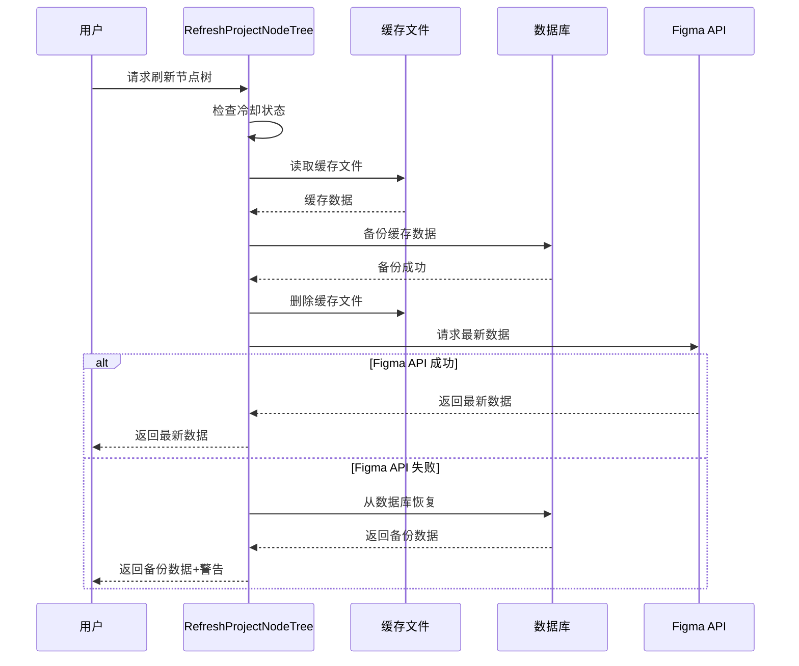

# 安全的缓存刷新机制

## 功能概述

在刷新节点树时，实现了一个**安全备份机制**：
- ✅ 删除缓存文件前，先将数据备份到数据库
- ✅ Figma API 请求失败时，自动从数据库恢复数据
- ✅ 确保用户始终能看到数据，即使刷新失败

## 工作流程



## 核心实现

### 1. 删除前备份 - `deleteCacheFile`

**文件**: `internal/controllers/cache.go`

```go
func deleteCacheFile(fileKey, nodeID string) {
    // 1. 检查缓存文件是否存在
    // 2. 读取缓存文件内容
    // 3. 保存到数据库（创建或更新）
    // 4. 删除缓存文件
}
```

#### 关键逻辑

**新建备份**：
```go
// 提取所有节点ID（用于子树查找）
nodeIDList, err := models.ExtractAllNodeIDs(string(cacheData))
nodeIDsStr := strings.Join(nodeIDList, ",")

cache := &models.FigmaFileCache{
    FileKey:     fileKey,
    RootNodeID:  nodeID,
    FileData:    string(cacheData),  // 完整的 JSON 数据
    NodeIDs:     nodeIDsStr,         // 逗号分隔的节点ID列表
    Status:      "loaded",
    CreatedAt:   uint32(time.Now().Unix()),
    UpdatedAt:   uint32(time.Now().Unix()),
}
models.CreateFileCache(cache)
```

**更新备份**：
```go
// 提取所有节点ID
nodeIDList, err := models.ExtractAllNodeIDs(string(cacheData))
nodeIDsStr := strings.Join(nodeIDList, ",")

// 只在数据更大时才更新（保持最完整的数据）
if existingCache.FileData == "" || len(cacheData) > len(existingCache.FileData) {
    existingCache.FileData = string(cacheData)
    existingCache.NodeIDs = nodeIDsStr  // 更新节点ID列表
    existingCache.Status = "loaded"
    existingCache.UpdatedAt = uint32(time.Now().Unix())
    models.UpdateFileCache(existingCache)
}
```

### 2. 失败时恢复 - `RefreshProjectNodeTree`

**失败处理逻辑**：

```go
nodes, fetchErr := services.GetFigmaNodes(user.FigmaToken, project.FileKey, project.RootNodeID)
if fetchErr != nil {
    // 尝试从数据库恢复
    cache, hit, err := cc.cacheService.GetFileCache(project.FileKey, project.RootNodeID)
    if err == nil && hit && cache != nil && cache.FileData != "" {
        // 解析数据库中的数据
        var cachedNodes []map[string]interface{}
        if err := json.Unmarshal([]byte(cache.FileData), &cachedNodes); err == nil {
            // 返回备份数据，并附带警告
            return gin.H{
                "success": true,
                "message": "Figma API 请求失败，已返回数据库备份数据",
                "warning": "数据可能不是最新的",
                "nodes":   cachedNodes,
                "error":   fetchErr.Error(),
            }
        }
    }
    
    // 无法恢复，返回错误
    return error
}
```

## 数据流

### 正常刷新流程

```
缓存文件 → 备份到数据库 → 删除文件 → Figma API → 返回最新数据
```

### 失败恢复流程

```
缓存文件 → 备份到数据库 → 删除文件 → Figma API (失败) → 从数据库恢复 → 返回备份数据
```

## 响应格式

### 成功刷新

```json
{
  "success": true,
  "message": "节点树刷新成功",
  "nodes": [ /* 最新节点数据 */ ]
}
```

### 使用备份数据（API 失败）

```json
{
  "success": true,
  "message": "Figma API 请求失败，已返回数据库备份数据",
  "warning": "数据可能不是最新的",
  "nodes": [ /* 备份的节点数据 */ ],
  "error": "API请求失败: 403 Forbidden"
}
```

### 完全失败（无备份）

```json
{
  "error": "获取Figma节点树失败: API请求失败"
}
```

## 数据库表结构

### figma_file_caches

用于存储备份数据：

| 字段 | 类型 | 说明 |
|------|------|------|
| file_key | string | Figma 文件 Key |
| root_node_id | string | 根节点 ID |
| node_ids | text | **逗号分隔的所有节点ID列表**（用于子树查找） |
| file_data | mediumtext | 完整的 JSON 数据（最大 16MB） |
| status | string | 状态：loaded |
| created_at | uint32 | 创建时间（Unix 时间戳） |
| updated_at | uint32 | 更新时间（Unix 时间戳） |

**node_ids 字段说明**：
- 在备份时自动从节点树中递归提取所有节点ID
- 格式：`"1:123,1:124,2:456,2:457"`
- 用途：支持子树查找功能（通过 `FIND_IN_SET` 快速判断节点是否在树中）
- 提取逻辑：使用 `models.ExtractAllNodeIDs()` 函数

## 优势

### ✅ 1. 高可用性
即使 Figma API 暂时不可用，用户仍能看到数据

### ✅ 2. 数据安全
删除缓存前自动备份，避免数据丢失

### ✅ 3. 降级优雅
API 失败时平滑降级到备份数据，附带清晰提示

### ✅ 4. 透明性
返回数据时明确告知是最新数据还是备份数据

### ✅ 5. 零用户干预
整个备份和恢复过程自动化，无需用户操作

### ✅ 6. 支持子树查找
自动提取并保存所有节点ID，支持高效的子树查找和匹配

## 使用场景

### 场景 1：正常刷新
```bash
用户点击"刷新" → 备份旧数据 → 请求 Figma API → 返回最新数据
```

### 场景 2：Figma API 限流
```bash
用户点击"刷新" → 备份旧数据 → 请求失败(429) → 返回备份数据 + 提示
```

### 场景 3：网络故障
```bash
用户点击"刷新" → 备份旧数据 → 请求超时 → 返回备份数据 + 提示
```

### 场景 4：Token 过期
```bash
用户点击"刷新" → 备份旧数据 → 请求失败(401) → 返回备份数据 + 错误信息
```

## 性能考虑

### 备份性能
- **文件读取**: 通常 < 10ms
- **数据库写入**: 通常 < 50ms
- **总开销**: < 100ms（相比 Figma API 请求的数秒可忽略）

### 恢复性能
- **数据库读取**: 通常 < 20ms
- **JSON 解析**: 通常 < 30ms
- **总时间**: < 100ms（几乎即时返回）

## 存储成本

### 单条缓存记录
- **平均大小**: 100KB - 1MB（取决于节点数量）
- **最大大小**: 16MB（mediumtext 限制）
- **估算**: 1000 个项目 ≈ 100MB - 1GB

## 测试建议

### 1. 正常流程测试
```bash
# 第一次刷新（创建备份）
curl -X GET "http://localhost:8080/figma/project/8/node-tree/refresh"

# 检查数据库是否有备份
SELECT file_key, root_node_id, LENGTH(file_data) as size 
FROM figma_file_caches 
WHERE file_key = 'xxx';
```

### 2. 失败恢复测试

**模拟方法**：
1. 临时修改 Figma Token 为无效值
2. 调用刷新接口
3. 验证是否返回备份数据

**预期结果**：
```json
{
  "success": true,
  "warning": "数据可能不是最新的",
  "nodes": [ /* 备份数据 */ ]
}
```

### 3. 多次刷新测试
```bash
# 刷新 3 次，验证备份不会重复创建
for i in {1..3}; do
  curl -X GET "http://localhost:8080/figma/project/8/node-tree/refresh"
  sleep 35  # 等待冷却
done

# 检查数据库记录数（应该只有 1 条）
SELECT COUNT(*) FROM figma_file_caches WHERE file_key = 'xxx';
```

## 注意事项

### ⚠️ 1. 数据可能过期
备份数据不会自动更新，只在刷新时更新

### ⚠️ 2. 存储空间
大量项目可能占用较多数据库空间

### ⚠️ 3. JSON 格式
确保存储的是完整的、可解析的 JSON 数据

### ⚠️ 4. 同步问题
文件缓存和数据库缓存可能短暂不一致

## 未来优化

### 📝 TODO 1: 定期清理
自动清理超过 30 天未使用的备份数据

### 📝 TODO 2: 压缩存储
对大型 JSON 数据进行压缩，减少存储空间

### 📝 TODO 3: 版本管理
保留多个历史版本，支持回滚

### 📝 TODO 4: 智能更新
根据节点变更情况，智能决定是否需要全量刷新

## 总结

✅ 实现了安全的缓存刷新机制  
✅ 删除前自动备份到数据库  
✅ API 失败时自动恢复数据  
✅ 自动提取并保存所有节点ID（支持子树查找）  
✅ 用户体验更好，系统更可靠  
✅ 零额外配置，开箱即用

---

**实现时间**: 2025-11-19  
**修改文件**: 
- `internal/controllers/cache.go` - 添加 `deleteCacheFile` 函数和恢复逻辑

**相关文档**: 
- [节点树刷新冷却检查](BUGFIX_NODE_TREE_REFRESH_WITH_COOLDOWN.md)
- [Figma缓存系统完整方案](FIGMA_CACHE_RATE_LIMIT_SOLUTION.md)

